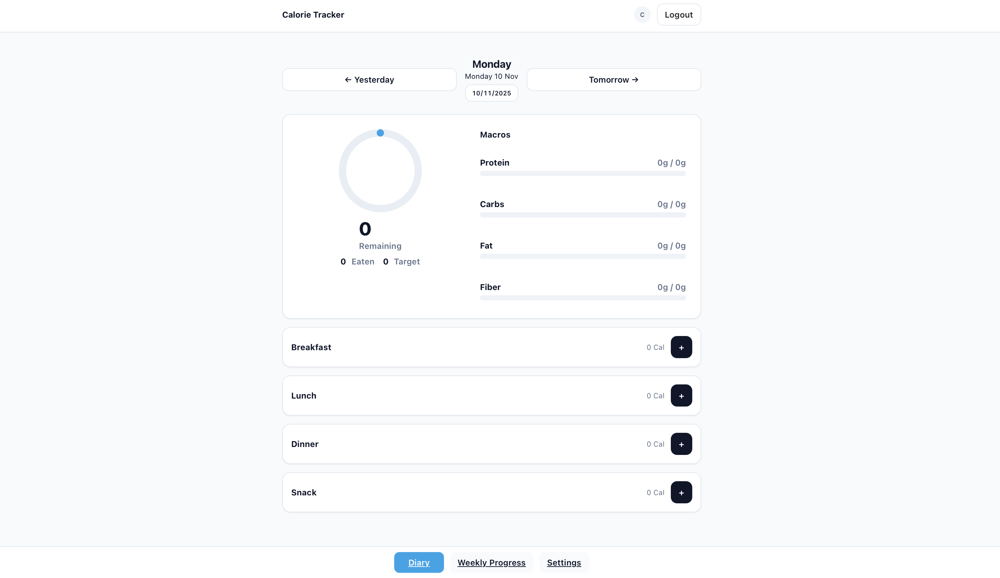
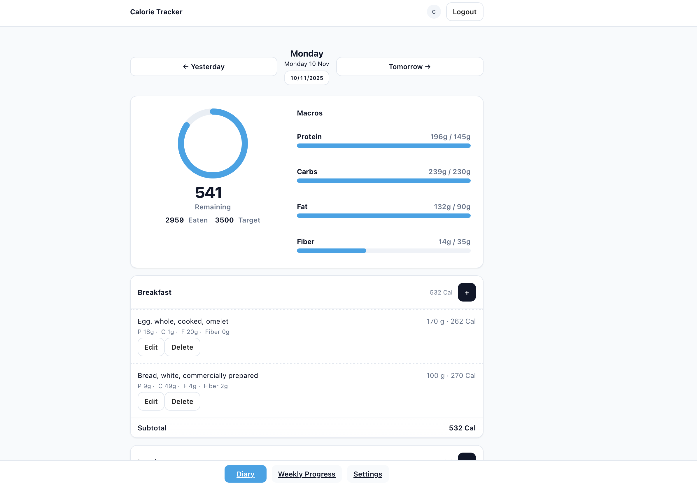
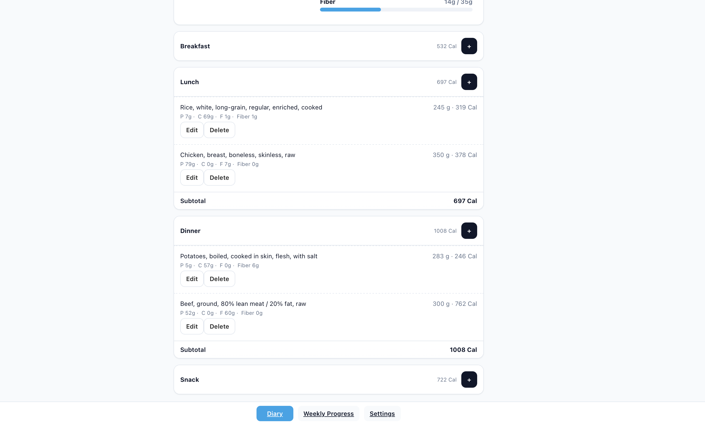
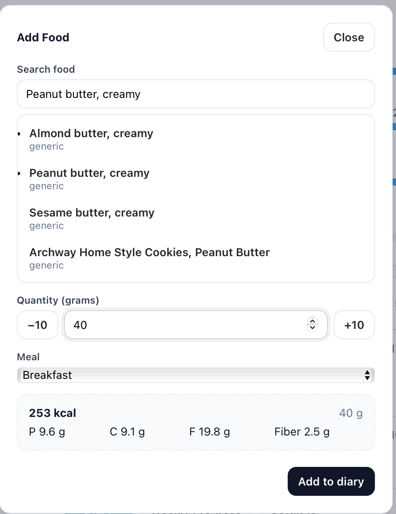
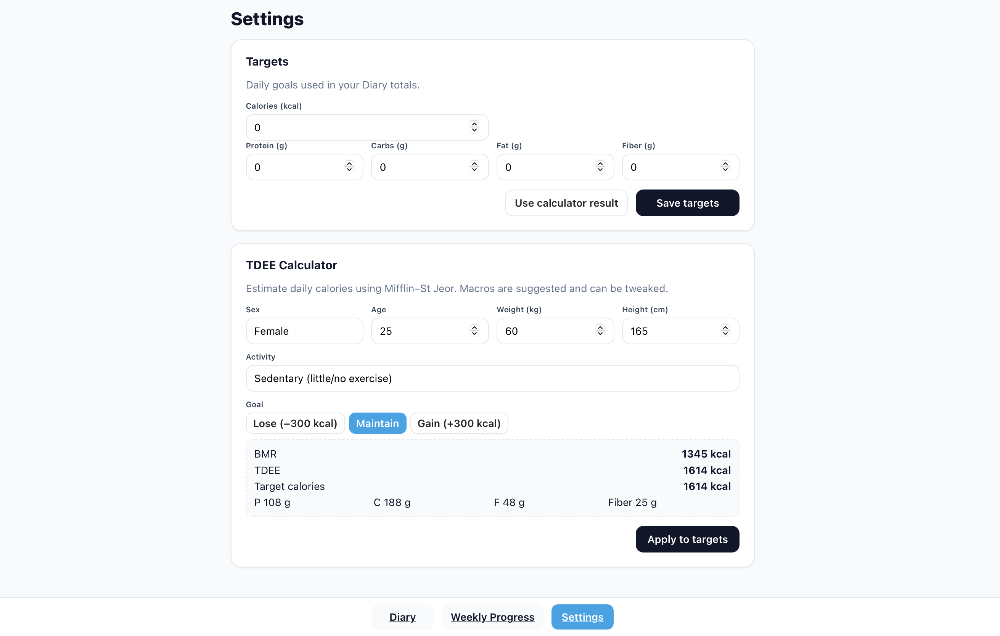
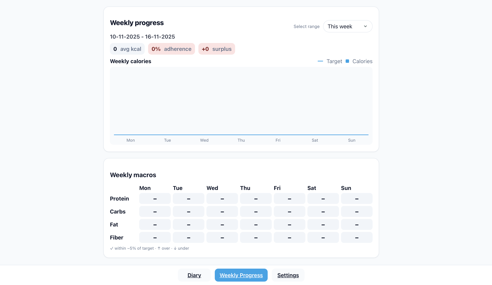
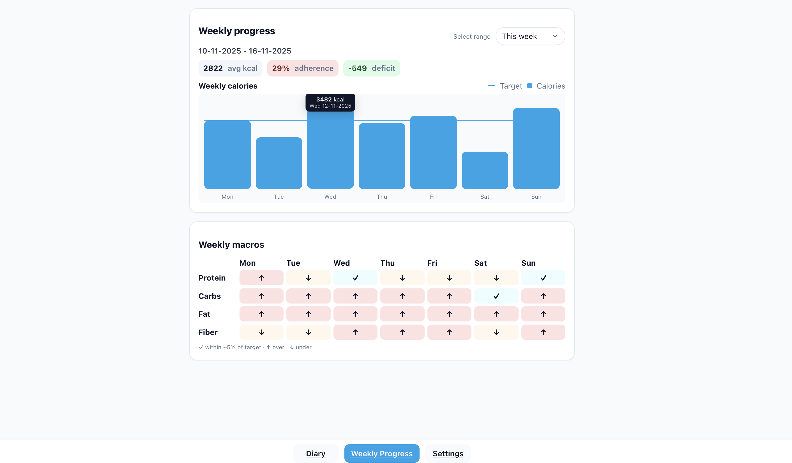
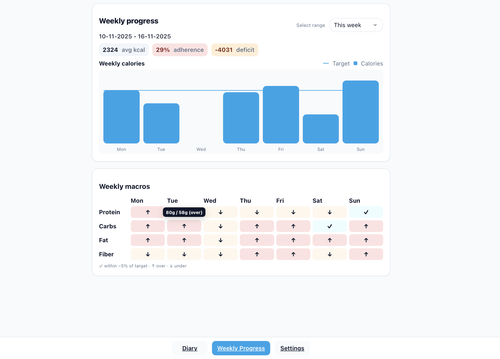

# Caloriq  
**Built & Designed by Leanne James Llena**

## 📘 Overview
Caloriq is a modern **MERN** application designed for simple, everyday nutrition tracking.

It focuses on a clean, mobile-friendly UI and the features people actually use:
- Log foods  
- Track your daily calories and macros  
- Set personal targets  
- Review weekly progress  

Everything is secured with **JWT auth** and **HTTP-only refresh cookies**.

---

## ✨ Features

### 🔐 Sign up & log in securely
- JWT access token (kept in memory) + HTTP-only refresh cookie  
- Automatic token refresh  
- Safe logout and per-user data isolation 

---

### 📆 Track your day (Diary)
- Navigate days with arrows or the built-in date picker  
- Four diffent meals sections: **Breakfast · Lunch · Dinner · Snack**  
- Add foods using **USDA FoodData Central search**  
- Enter any amount in grams → **live kcal & macro calculation**  
- Edit, move, or delete entries — totals update instantly  
- Daily header shows **Remaining**, **Eaten**, and **macro bars vs your targets**  

---

### 🎯 Set & calculate your targets (Settings)
- Manually set daily **Calories, Protein, Carbs, Fat, Fiber**  
- Or use the built-in **TDEE calculator** (Mifflin–St Jeor + activity level)  
- Choose your goal: **Lose / Maintain / Gain**  
- “Use calculator result” and "Apply to  targets" both fills the form with TDEE Calculator's given Targets
- **Save Targets** applies the changes and save them to the database

---

### 📊 Review your week (Weekly Progress)
- Weekly calories shown as a **bar chart with a target line** which represents the target calories
- Hover to see exact kcal & date  
- Click a bar → instantly open that day in the Diary  
- Macro tiles show per-day status:
  - ✓ within ~5% of target  
  - ↑ over  
  - ↓ under  
- Summary includes:
  - **Average calories**  
  - **Adherence** (% of days within ~5%)  
  - **Weekly surplus/deficit** (green / amber / red)  

---

### 🥫 Food Caching (Smart & Fast)
When a user searches for food:

1. Backend checks the **FoodCache** collection  
2. If found → returns instantly  
3. If not → fetches once from FoodData Central  
   - Only **Foundation** + **SR Legacy** datasets  
   - Normalizes nutrients  
   - Saves to cache  

Future searches skip external API calls → fast, consistent, efficient.

---

### 🧩 Thoughtful UX
- Clean, responsive layout  
- Diary remembers last viewed date across refresh  
- Weekly Progress remembers last chosen range  
- Smooth interactions, helpful tooltips, clean selects, readable typography  

---

## 📷 Screenshots

Here are some previews of the Caloriq UI.

---

### 🥣 Diary Views

<p align="center">
  
</p>

<p align="center">
  
</p>

<p align="center">
  
</p>

---

### 🔍 Food Search Popup

<p align="center">
  
</p>

---

### ⚙️ Settings View

<p align="center">
  
</p>

<p align="center">
  
</p>

---

### 📊 Weekly Progress Views

<p align="center">
  
</p>

<p align="center">
  
</p>

<p align="center">
  
</p>


---

## 🌐 Live Demo Instructions
1. Register with email + password (min 6 chars)  
2. Log in  
3. Go to **Settings**
   - Set targets manually **or** use the TDEE Calculator  
   - Fill out the form  
   - Choose your goal  
   - Press *Use calculator result* or *Apply Targets*. NOTE: Both buttons only fills the form with TDEE Calculator's given Targets
   - Press **Save Targets** to actually save the Targets
4. Go to **Diary** (defaults to Today)
5. Add foods:
   - Press **+** on a meal  
   - Search → pick variant (raw, cooked, etc.)  
   - Enter grams → see live macros  
   - Choose meal  
   - Press **Save**
6. Each meal section show subtotals; click to expand foods and see listed food's in the certain section
7. Edit or delete anytime  
8. Weekly Progress shows your calorie & macro trends  

**Live Demo Link:**  
https://calorie-tracker-frontend-ecru.vercel.app/

## 🛠️ Built With
### Frontend
- React + Vite  
- CSS Modules  
- Zustand
- **Deployed on Vercel:**  

### Backend
- Node.js + Express  
- MongoDB (Mongoose)  
- **Deployed on Render**

### Auth
- In-memory JWT access token  
- HTTP-only refresh cookie  

### Other
- API testing: Thunderclient  
- Data Source: **USDA FoodData Central**
  - Foundation + SR Legacy only  
  - Normalized per 100 g  
  - Each diary entry stores a nutrient snapshot  

---

## 🔒 Security & Privacy
- Access token stored **in memory only**  
- Refresh token stored in **HTTP-only cookie**  
- Logout clears cookie & UI preferences  
- Input validation across all endpoints  
- Per-user authorization on all Diary CRUD operations  

---

## 📂 Project Structure

### Frontend

```bash
calorie-tracker/
├── client/                       # React frontend (Vite)
│   ├── public/                   # empty
│   │
│   └── src/
│       ├── assets/               # empty
│       │
│       ├── components/           # Reusable UI components
│       │   ├── AddFoodSheet/
│       │   │   ├── AddFoodSheet.jsx
│       │   │   └── AddFoodSheet.module.css
│       │   │
│       │   ├── DatePicker/
│       │   │   ├── DatePicker.jsx
│       │   │   └── DatePicker.module.css
│       │   │
│       │   ├── DaySummary/
│       │   │   ├── DaySummary.jsx
│       │   │   └── DaySummary.module.css
│       │   │
│       │   ├── Footer/
│       │   │   ├── Footer.jsx
│       │   │   └── Footer.module.css
│       │   │
│       │   ├── Header/
│       │   │   ├── Header.jsx
│       │   │   └── Header.module.css
│       │   │
│       │   ├── MacroBar/
│       │   │   ├── MacroBar.jsx
│       │   │   └── MacroBar.module.css
│       │   │
│       │   └── MealCard/
│       │       ├── MealCard.jsx
│       │       └── MealCard.module.css
│       │
│       ├── hooks/
│       │   └── useDebounce.js
│       │
│       ├── pages/                # Full pages routed by React Router
│       │   ├── Auth/
│       │   │   ├── Login/
│       │   │   │   ├── Login.jsx
│       │   │   │   └── Login.module.css
│       │   │   │
│       │   │   └── Register/
│       │   │       ├── Register.jsx
│       │   │       └── Register.module.css
│       │   │
│       │   ├── Diary/
│       │   │   ├── Diary.jsx
│       │   │   └── Diary.module.css
│       │   │
│       │   ├── History/
│       │   │   ├── History.jsx
│       │   │   ├── History.module.css
│       │   │   ├── HistoryHeader.jsx
│       │   │   ├── KcalBars.jsx
│       │   │   ├── KcalBars.module.css
│       │   │   ├── MacroTiles.jsx
│       │   │   ├── MacroTiles.module.css
│       │   │   └── useHistoryData.js
│       │   │
│       │   ├── NotFound/
│       │   │   └── NotFound.jsx
│       │   │
│       │   └── Settings/
│       │       ├── Settings.jsx
│       │       └── Settings.module.css
│       │
│       ├── routes/
│       │   └── index.jsx          # React Router setup
│       │
│       ├── services/              # Axios API clients
│       │   ├── api.js
│       │   ├── auth.api.js
│       │   ├── diary.api.js
│       │   ├── foods.api.js
│       │   ├── history.api.js
│       │   └── profile.api.js
│       │
│       ├── store/                 # Zustand stores
│       │   ├── authStore.js
│       │   └── diaryStore.js
│       │
│       ├── styles/                # Global CSS (not modules)
│       │   ├── reset.css
│       │   ├── ui.css
│       │   └── variables.css
│       │
│       ├── utils/                # Date format helpers
│       │   ├── date.js
│       │   └── week.js
│       │
│       ├── App.jsx
│       └── main.jsx
│   
│   ├── package-lock.json
│   ├── package.json
│   └── index.html
│   └── vite.config.js
│   └── vercel.json.         # Helps Vercel send API requests to the backend and keeps the app from breaking when reloading a page.
```
### Backend

```bash
server/
├─ node_modules/
├─ src/
│  ├─ config/
│  │  ├─ db.js                # MongoDB connection (Mongoose)
│  │  └─ env.js               # Loads & store environment variables in an object(config)
│  │
│  ├─ controllers/            # Handle requests, call services, return responses
│  │  ├─ auth.controller.js
│  │  ├─ diary.controller.js
│  │  ├─ foods.controller.js
│  │  ├─ history.controller.js
│  │  └─ profile.controller.js
│  │
│  ├─ integrations/           # External API clients
│  │  └─ fdc.client.js        # FoodData Central fetch client
│  │
│  ├─ middleware/
│  │  └─ auth.js              # Access token verification middleware
│  │
│  ├─ models/                 # Mongoose schemas
│  │  ├─ DiaryEntry.model.js
│  │  ├─ FoodCache.model.js
│  │  └─ User.model.js
│  │
│  ├─ routes/                 # API route definitions
│  │  ├─ auth.routes.js
│  │  ├─ diary.routes.js
│  │  ├─ foods.routes.js
│  │  ├─ history.routes.js
│  │  ├─ profile.routes.js
│  │  └─ index.js             # Mounts all subroutes under /api
│  │
│  ├─ services/               # Business logic (DB ops + external APIs)
│  │  ├─ auth.service.js
│  │  ├─ diary.service.js
│  │  ├─ foods.service.js
│  │  ├─ history.service.js
│  │  └─ profile.service.js
│  │
│  ├─ utils/                  # Helper utilities
│  │  ├─ dates.js             # Date & timezone helpers
│  │  ├─ jwt.js               # JWT create/verify helpers
│  │  └─ nutrition.js         # Normalization & macro calculations
│  │
│  ├─ app.js                  # Express app setup (middleware, routes, cors)
│  └─ index.js                # Server entry — connects DB + starts API
│
├─ .env                       # own environment variables (ignored by Git)
├─ .env.example               # Env variables template for other developers
├─ package.json
├─ package-lock.json
└─ .gitignore
```

---

## 📚 Lessons Learned

Building this full-stack application provided invaluable experience in modern web development. 
Here are the key insights I gained:

### 🔐 Authentication & Security

*Challenge:* Implementing a secure authentication system that protects against common vulnerabilities like XSS attacks.

*Solution:* Instead of storing tokens in localStorage, I implemented a dual-token system with short-lived JWT access tokens (kept in memory) and secure HTTP-only cookies for refresh tokens. In addition, backend security was stengthend by adding security with helmet for HTTP headers, express-rate-limit to protect against spam attacks, and sanitized CORS configuration to ensure that cookies are only shared between trusted origins.

*Learning:* I gained a deeper understanding of web security fundamentals and how proper token storage is crucial for production-ready applications.

### 🎨 Data Visualization & UX Design

*Challenge:* The weekly progress and diary views had to show nutritional information clearly, without ever feeling slow or clunky on any device. My early attempts were a bit messy; buttons didn't match, the layout felt cramped, and it was hard to tell at a glance how you were doing on your macros. All of this made the screen feel crowded and confusing.

*Solution:* My approach was to rebuild the interface with a clean, grid-based structure. I introduced reusable components like KcalBars and MacroTiles to visually represent weekly calories and macro nutrients. I established a single style for all buttons, tightened up the spacing and fonts for a more modern look, and added subtle color-coding (green, yellow, red) so users could understand their progress in an instant.

*Learning:* I learned how thoughtful spacing, consistent components, and visual feedback can massively improve user experience. Even small design refinements such as aligning buttons, standardizing card layouts, and color-coding performance, can make a data-heavy app feel intuitive and enjoyable to use.

### 🔄 Refresh Tokens & Single Page Application(SPA) Routing

*Challenge:* After deployment, the refresh token wasn’t working and users were logged out on every page reload. This happened because the frontend (Vercel) and backend (Render) were on different domains, causing the browser to block the HTTP-only refresh cookie. Additionally, refreshing routes like /diary or /history resulted in Vercel's 404 page instead of loading the React app.

*Solution:* I added a vercel.json file in the client's root directory(client/) that forwards all /api requests through the frontend domain, allowing the browser to send the refresh cookie safely. The same file also adds a fallback rewrite so Vercel always serves index.html for non-API routes, letting React Router handle page reloads.

*Learning:* I learned how cross-domain requests affect cookie behavior, and how routing rewrites are essential for deploying single-page applications. These fixes made both authentication and page navigation work smoothly in production.

---

## Installation & Setup
1. Clone the repository
- git clone https://github.com/LeanneJamesLlena/calorie-tracker.git
2. Install server dependencies
- cd server
- npm install
- create your own .env file inside server's root directory(server)
- copy all env variables template from .env.example
- paste it to your .env file and add correct values
- cd .. (navigate back to calorie-tracker)

3. Install client dependencies
- cd client
- npm install
- create your own .env file inside client's root directory(client)
- add one and only .env variable inside .env: VITE_API_URL=http://localhost:4000/api
- cd .. (navigate back to calorie-tracker)
4. Start the backend
- cd server
- make sure your inside server!(prompt "pwd" into code editor's terminal to check pre working directory) then "npm run server" to start the server
- cd .. (navigate back to calorie-tracker directory)
5. Start the frontend
- cd client
- make sure your inside client!(prompt "pwd" into code editor's terminal to check pre working directory) then "npm run dev" to start the client/frontend server.
6. Open a web browser and go to http://localhost:5173/. Boom! Your app is running.